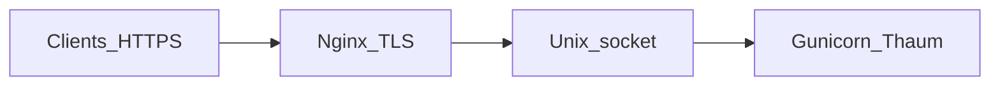

# Thaum containerless quickstart (Unix domain socket)

This path runs Thaum **without** Podman: a Python venv, **gunicorn** bound to a **Unix domain socket**, and **nginx** in front for TLS and HTTP/1.1 proxying.

## Why prefer a Unix socket over loopback TCP?

On a host running many services, **127.0.0.1:port** is often reachable by **any local process** that can open TCP connections. A **socket file** can be restricted with **ownership and mode** (and optionally SELinux/AppArmor), so only nginx (or a small group) can connect. That narrows who can talk to the app directly.

## Layout

| Piece | Example path |
|-------|----------------|
| Application tree | `/srv/thaum/app` (clone; contains `app.py`) |
| Virtualenv | `/srv/thaum/venv` |
| Config | `/etc/thaum/thaum.conf` (from [`../thaum.conf.example`](../thaum.conf.example)) |
| App database | Depends on `[server.database].db_url` / secrets (e.g. SQLite file under `/var/lib/thaum/`, or PostgreSQL); align paths and credentials with your config |
| Logs | `/var/log/thaum/` — enable `[logging] file = true` |
| Unix socket | `/run/thaum/thaum.sock` |

Create a dedicated **`thaum`** user and group. Nginx typically runs as `www-data` or `nginx`; add that user to a group that may access the socket, **or** use a shared group (e.g. `thaum` group includes both `thaum` and `www-data`) and set the socket directory to `0750` and socket to `0660` if your setup requires nginx to connect as group `thaum`. Exact ownership varies by distribution—verify with `ls -l /run/thaum/` after the first start.

## 1) tmpfiles.d

Install [`examples/thaum.tmpfiles.conf.example`](examples/thaum.tmpfiles.conf.example) as `/etc/tmpfiles.d/thaum.conf`, then:

```bash
sudo systemd-tmpfiles --create
```

## 2) Config and secrets

- Copy [`../thaum.conf.example`](../thaum.conf.example) to `/etc/thaum/thaum.conf` and set non-secret fields (`base_url`, Jira site, etc.).
- Create encrypted credentials (same `secret:` IDs as the Quadlet path):

```bash
sudo ./quickstart/systemd/scripts/setup-systemd-credentials.sh
```

- Optional: install a systemd drop-in from [`../quadlet/thaum.service.credentials.conf.example`](../quadlet/thaum.service.credentials.conf.example) to `/etc/systemd/system/thaum.service.d/credentials.conf` so `secret:name` resolves for the service.

## 3) systemd unit (gunicorn + UDS)

Install [`examples/thaum-gunicorn.service.example`](examples/thaum-gunicorn.service.example) as `/etc/systemd/system/thaum.service` after adjusting `WorkingDirectory`, `ExecStart` venv path, and socket path.

```bash
sudo systemctl daemon-reload
sudo systemctl enable --now thaum.service
sudo systemctl status thaum.service
```

The example service uses a fail-fast restart policy:

- `Restart=on-failure` (not `always`)
- `RestartPreventExitStatus=10 11 12 40` (reserved permanent-failure codes)
- `StartLimitIntervalSec=300` + `StartLimitBurst=5` (limits rapid restart churn)

This keeps retries for transient failures while preventing infinite loops for known show-stoppers.

Confirm the socket exists:

```bash
ls -l /run/thaum/thaum.sock
```

Check effective restart settings:

```bash
sudo systemctl show thaum.service \
  -p Restart \
  -p RestartPreventExitStatus \
  -p StartLimitIntervalUSec \
  -p StartLimitBurst
```

Validate unit syntax after edits:

```bash
sudo systemd-analyze verify /etc/systemd/system/thaum.service
```

## 4) nginx

Install [`examples/nginx-thaum.conf.example`](examples/nginx-thaum.conf.example) under your nginx `sites-enabled` (path varies by distro). Reload nginx:

```bash
sudo nginx -t && sudo systemctl reload nginx
```

The critical directive is:

```nginx
proxy_pass http://unix:/run/thaum/thaum.sock:;
```

Note the **trailing colon** after `.sock` in nginx’s `unix:` upstream form.

## 5) Optional: loopback TCP instead (debugging)

For a simpler lab setup, you can bind gunicorn to `127.0.0.1:5165` and use `proxy_pass http://127.0.0.1:5165;` in nginx. This is easier to debug but weaker on shared hosts than a permissioned Unix socket.


